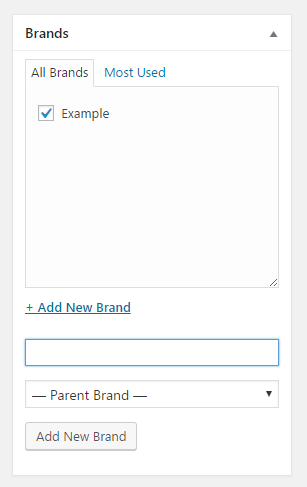
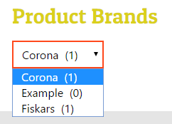

# RS WooCommerce Brands

A WordPress plugin which adds a new taxonomy to your products, Brands. Includes a widget to filter brands for use in your store's sidebar, and some utility functions to use brands in other situations.

    Contributors: radgh
    Donate link: https://paypal.me/radgh
    Tags: woocommerce
    Requires at least: 2.3.0
    Tested up to: 4.7.4
    Stable tag: 1.0.1
    License: GPLv3
    License URI: http://www.gnu.org/licenses/gpl-3.0.txt

## Description ##

Adds a the "Brands" taxonomy to your WooCommerce products, and a widget to filter your store by brand.

The "WooCommerce product brands" widget is essentially a copy of the default WooCommerce product category widget, and has all of the same features.

## Installation ##

1. Upload the plugin files to `/wp-content/plugins/rs-wc-brands/`, or install the plugin through the WordPress plugins screen directly.
1. Activate the plugin through the 'Plugins' screen in WordPress
1. Edit your products and assign them to brands, just like you would with categories.

## Frequently Asked Questions ##

**Are there any additional features or settings pages?**

No, this is intentionally a simple and lightweight plugin.

## Screenshots ##

## Changelog ##

#### 1.0
* First release

## Upgrade Notice ##

Nothing to worry about.